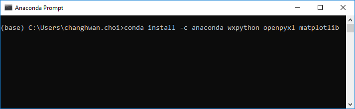

# T-Coil Evaluation Program - Analysis and Visualization Toolkit
This project was built to facilitate the analysis and visualization of T-Coil area scan results. The program takes ‘.txt’ data files from the T-Coil area scans and generates plots/tables displaying the data and analysis results. The generated results and figures can be exported into ‘.xlsx’ Excel files and separate ‘.png’ image files.

The project was developed in Python 3.6.

## Getting Started
### Overview
#### Programs
* [Anaconda3/Miniconda3]( https://www.anaconda.com/download/)
   * Python projects often implement a variety of different third party libraries which, as projects scale up, can be hard to manage in an organized fashion. As a Python distribution, Anaconda provides the core Python language, hundreds of core packages, a variety of different development tools (e.g. IDEs), and **conda**, Anaconda’s package manager that facilitates the downloading and management of Python packages.
* [Python 3.6]( https://www.python.org/downloads/) (included in Anaconda3/Miniconda3)
   * Python is the main programming language for this project. It has an active open-source community and easily readable code syntax, making Python a great language of choice for projects like these. 
*	An Integrated Development Environment (IDE) supporting Python – [PyCharm]( https://www.jetbrains.com/pycharm/download/) is recommended.
    * While PyCharm is not necessary to run this program, we highly recommend it for Python-based development. It is easy to integrate it with Anaconda and provides fantastic tools/shortcuts/hotkeys that make development faster and easier.

#### Packages (can be installed using Anaconda):
-	openpyxl
-	NumPy
-	Pandas
-	Matplotlib
-	WxPython

### Installation
1.	First, install [Anaconda3/Miniconda3]( https://www.anaconda.com/download/), which comes with the latest stable version of Python (3.6 at the time of writing this README) included. Choose the appropriate installation for your respective operating system.
2.	Install [PyCharm]( https://www.jetbrains.com/pycharm/download/) or any other IDE that supports Python.

*Note: the following steps will show how to set up the environment using Anaconda and PyCharm, but the project is not restricted to these tools exclusively.*

3.	We will now install the different packages required to run the scripts.
  * Open **Anaconda Navigator** and click on **Environments** tab on the left.
  
   
  
  * Select **Not installed** from the dropdown menu.
  
  
  
  * From here, we can search for each of the different packages listed above (in the Packages subsection of the Overview). To download the packages, check the box next to the package and click **Apply** at the bottom. Keep in mind that some of these packages may already have come with the full Anaconda installation.
  * Some packages may not be found using the Navigator. In this case, they must be downloaded using **Anaconda Prompt**. Open the prompt and type the following: `conda install -c anaconda <package_names_space-separated>`.
  
  

*Note: Alternatively, you can add the packages in the **Project Interpreter** section of the project settings in PyCharm. However, this must be done after the project has been opened and the project interpreter has been selected, which will be done in the next few steps.*

4.	Open PyCharm and open the project – select the **hac** folder in the “Open File or Project” window.

  
  
5.	Select **File->Settings…** and select the **Project Interpreter** tab on the left. Click on the cog and select **Add…**.
  
  
  
  * Click on the **System Interpreter** tab on the left and select the location of the python.exe file from your Anaconda/Miniconda installation (most probably found in `C:\Users\<user>\AppData\Local\Continuum\anaconda3\python.exe`).

## Deployment
Open `hac/hactolerance/hactolerance.py` and click run (green play button at the top right of PyCharm). To run from the command line, open the Anaconda Prompt and enter: 
```bash
python hactolerance.py
```
while in the `hac/hactolerance` directory.
Alternatively, you can run the program directly from the Windows command line, but you must first add python to the PATH variables of the system. Follow the steps [here] (https://superuser.com/questions/143119/how-to-add-python-to-the-windows-path).

A basic GUI will appear with preset/default analysis parameters.


### Single File Analysis
The single file analysis function determines which coordinates of the area scan readings are over the specified threshold (dB A/m).
The analysis takes the raw ‘.txt’ input file specified in the **Input ‘.txt’ File (ABM1 or Single File)** text line.

To begin the analysis, click on the **Run** button at the bottom right of the GUI window. Once the analysis has been completed, the plot subsection will display a heatmap built from the original data and a region of interest composed of points greater than or equal to the threshold.

The figures and data tables can be exported into an ‘.xlsx’ file. This file will contain a table of power values color formatted to show the region/points within tolerance as well as the maximum power point. The file also has the graphs resulting from the analysis on the GUI.


### Dual File Analysis (ABM1, ABM2)
The dual file analysis function provides a more thorough analysis that includes the signal to noise ratio (ABM1 – ABM2), the sizes and dimensions of the different tolerance regions, the number of tolerance compliant points, etc., as well as visualizations of these results.
The analysis takes two raw ‘.txt’ files specified in the **Input ‘.txt’ File (ABM1 or Single File)** and **Input ‘.txt’ File (ABM2)** text lines.

To begin the analysis, click on the **Run** button at the bottom right of the GUI window – the program will automatically perform the dual file analysis without having to specify it elsewhere in the GUI.

The figures and data tables can be exported into an ‘.xlsx’ file and separate png files in a directory. The Excel file will contain a table of ABM1 power values, a table of ABM2 power values, a table of ABM1-ABM2 power ratios, a heatmap table of power ratios, region-colored table of power ratios, and the resulting visualizations fromm the GUI analysis.


### Shortcut Keys
The program has a few shortcuts to accelerate the process of analyzing multiple files.

`Ctrl + 1` - Load file 1

`Ctrl + 2` - load file 2

`Ctrl + R` - Run analysis

`Ctrl + E` - Export analysis results

`Ctrl + W` - Quit program

`Ctrl + H` - Open shortcut keys reference

## In-Depth Analysis Algorithm Description
Main Functions: `MainFrame.datatodf()`, `'MainFrame.getcontourdf()`, `MainFrame.getregions()`

### Single File Analysis
Single file analysis begins by converting the raw input data (from the '.txt' file) into a Pandas DataFrame (essentially an array), where all data points are reorganized into their respective coordinates. Note that the data from the automated area scan is collected by zig-zagging through columns, appending each data point into a list of values recorded on a '.txt' file.

[TODO: maybe add a picture of this zig-zag scan?]

After organizing the data into a DataFrame, we compare each element in the DataFrame to a threshold value (set prior to running the analysis). A copy of the DataFrame is made and all values within this tolerance limit are set to 1, while all others are set to 0.

On completion, the original DataFrame is plotted as a heatmap, and the region DataFrame (i.e. the DataFrame with 1s for regions within tolerance and 0s for regions outside tolerance) is plotted in black and white.

### Dual File Analysis (ABM1, ABM2)
Dual file analysis begins by converting the two sets of raw input data (from '.txt' files) into separate Pandas DataFrames (essentially arrays), where all data points are reorganized into their respective coordinates. Note that the data from the automated scan is collected by zig-zagging through columns, appending each data point into a list of values recorded on a '.txt' file.

[TODO: maybe add a picture of this zig-zag scan?]

After organizing the data into DataFrames, we compare each element in the DataFrames to their respective threshold values (set prior to running the analysis). Copies of the DataFrames are made and all values within their respective tolerance limits are set to 1, while all others are set to 0.

We then identify the different regions found within the ABM2 DataFrame. A [region growing](https://en.wikipedia.org/wiki/Region_growing) algorithm has been implemented to individually extract all separate, contiguous regions from the scan. First, the ABM2 region DataFrame (i.e. the DataFrame with 1s for regeions within tolerance and 0s for regions outside tolerance) is set as a reference point. We select one of the points within the ABM2 tolerance region and check if it has any neighboring points (above, below, right, left). If so, add them to a queue and add the point to a list of indices for the current region. We then move onto the next point on the queue and check that point's neighbors, again adding them to the queue. Once all points of the queue have been gone through, this means we have isolated an individual, contiguous region. We then check the ABM2 region DataFrame to see if there are still any points we have not 'extracted', and we repeat the process.

We then have a list of indices for each region. Each of these is made into its own Region object, which takes these indices and rebuilds an array of their shape. Each of these regions are then checked, column by column, row by row, to determine if these regions fulfill the traversal and longitudinal size requirements.

Once all of this has been completed, the original data from the two input files are plotted as heatmaps, while the region DataFrames are plotted in color-coded fashion (red for secondary region, yellow for primary region, green for the overlapping sections, black elsewhere). A legend indicates the colors for each region and also shows what evaluation requirements have been met or not.

## Running the Tests
The project comes with automated tests to aid the continued development of the project. All test related files can be found in the `test` directory.

To run the tests, simply run `test/test_hactolerance.py` from PyCharm or run `pytest test_hactolerance.py` in the command line.

To test a specific test using PyCharm, click inside the test of choice and press `Ctrl + Shift + F10`. To do this from the command line, run `pytest test_hactolerance.py::<testing_function>`.

It is recommended that the project be tested often during development, as they help ensure that new changes made to the project do not break the current features of the program.

### Integration Tests
TODO: Add integration tests section

### Unit Tests
#### Region Class Tests
The Region class is a custom class built to contain the data for the regions-of-interest resulting from the dual input file analysis. The `reconstruct()` function takes in a list of coordinates/indices from which it then builds a NumPy array with the shape of the specified region (i.e. has values of 1 where the region is, 0 elsewhere). The object then also automatically finds the length of the longest contiguous row in the region as well as the length of the longest contiguous column in the region through `maxcontiguousrow()` and `maxcontiguouscol()`, respectively.

##### test_region_diamond()
The test feeds in the coordinates of a diamond-shaped region and expects a diamond array of the right dimensions to be reconstructed.

##### test_region_circle()
The test feeds in the coordinates of a circular region and expects a circle array of the right dimensions to be reconstructed.

##### test_region_triangle()
The test feeds in the coordinates of a triangular region and expects a triangle array of the right dimensions to be reconstructed.

##### test_region_square()
The test feeds in the coordinates of a squared region and expects a square array of the right dimensions to be reconstructed.

##### test_region_ushape()
The test feeds in the coordinates of a U-shaped region and expects a U-shape array of the right dimensions to be reconstructed.

##### test_region_filled()
The test feeds in the coordinates of a filled square region with no surrounding white space, and expects a square array of the right dimensions to be reconstructed.

#### MainFrame Class Tests
The MainFrame class is a custom class inheriting from the WxPython Frame class. This class contains all analysis scripts alongside GUI elements.
The three main analysis/processing functions are `datatodf()` which converts the raw input data into 2D Pandas DataFrames with the appropriate dimensions, `getcontourdf()` which builds contour DataFrames with the region of interest based on a threshold value and the input data DataFrame, and `getregions()` which extracts all the independent regions from a contour DataFrame and isolates them into separate lists of indices. These ioslated lists of indices are used to instantiate Region objects.
Each of the main functions have their respective excel files containing the expected outputs titled `<function_name>_input_check.xlsx`. The `hactolerance/test/Test Input Files` directory also contains the raw input files required to test the `datatodf()` function.
*TODO: Note, we might probably eventually want to separate the analysis scripts from the plain GUI!*

##### test_datatodf_onesonlyinput()
Tests whether the function can correctly build a uniform 27 x 27 (default size) DataFrame.

##### test_datatodf_countupinput()
This tests verifies that the DataFrame building process accounts for the fact that the area scan is performed in a zig-zag fashion.
Output table should have increasing values from left to right, zigzagging longitudinally.

##### test_datatodf_countdowninput()
This test is practically identical to `test_datatodf_countupinput()`, except the values countdown from left to right.

##### test_datatodf_differentdimensions()
This test verifies whether the function can build proper DataFrames of a variety of different dimensions (i.e. different number of points per column, non-square-shaped DataFrames, etc.)

##### test_getcountourdf_singletile()
This test is a trivial test to verify whether the function can handle this edge case. *TODO: may end up removing this test*

##### test_getcontourdf_toolowthresh()
This tests the case where the threshold value is smaller than the minimum value in the entire data. For the 'less than' subcase, the test expects an empty (i.e. full of zeros) DataFrame. Otherwise, it expects a full (i.e. full of ones) DataFrame. It tests the basic functionality of the 'less than', 'greater than' arguments in the function.

##### test_getcontourdf_toohighthresh()
This is similar the previous test, except that the threshold value tested with is greater than the maxmimum value in the data. Expects an empty DataFrame in the 'greater than' subcase, full DataFrame otherwise.

##### test_getcontourdf_lthresh_below1()
This tests the 'less than' case for threshold values below 1 dB A/m. Expects DataFrames with ones in the positions with values below the set threshold, zeros elsewhere. These threshold tests are performed to ensure that the algorithm does not add false positives or true negatives to the contourdf, as the value '1' may be below or above the set thresholds (i.e. the DataFrames must be zeroed out or given ones in the right order to ensure proper isolation of the regions).

##### test_getcontourdf_lthresh_over1()
This tests the 'less than' case for threshold values over 1 dB A/m. Expects DataFrames with ones in the positions with values below the set threshold, zeros elsewhere. These threshold tests are performed to ensure that the algorithm does not add false positives or true negatives to the contourdf, as the value '1' may be below or above the set thresholds (i.e. the DataFrames must be zeroed out or given ones in the right order to ensure proper isolation of the regions).

##### test_getcontourdf_gthresh_below1()
This tests the 'greater than' case for threshold values below 1 dB A/m. Expects DataFrames with ones in the positions with values over  the set threshold, zeros elsewhere. These threshold tests are performed to ensure that the algorithm does not add false positives or true negatives to the contourdf, as the value '1' may be below or above the set thresholds (i.e. the DataFrames must be zeroed out or given ones in the right order to ensure proper isolation of the regions).

##### test_getcontourdf_gthresh_over1()
This tests the 'greater than' case for threshold values over 1 dB A/m. Expects DataFrames with ones in the positions with values over the set threshold, zeros elsewhere. These threshold tests are performed to ensure that the algorithm does not add false positives or true negatives to the contourdf, as the value '1' may be below or above the set thresholds (i.e. the DataFrames must be zeroed out or given ones in the right order to ensure proper isolation of the regions).

##### test_getregions_unconnected_diamond()
This test whether the region growing algorithm appropriately separates diagonally-only connected points from each other. The region growing algorithm was implemented with a 4-connected neighborhood to ensure that no irregularly shaped/checkered regions are extracted. Expects a list of four separate points, each for one point of the diamond shape. If the function returns a single diamond, the test will fail. Note that if this test passes while Region Class tests fail, the results of the test cannot be trusted.

##### test_getregions_triangles()
This tests whether the region growing algorithm appropriately detects and isolates all triangle shaped-objects. This test verifies whether regions with overlapping rows/columns can be differentiated. Note that if this test passes while Region Class tests fail, the results of the test cannot be trusted.

##### test_getregions_squares()
This tests whether the region growing algorithm can appropriately parse all separate square objects in the contour DataFrame. Note that if this test passes while Region Class tests fail, the results of the test cannot be trusted.

##### test_getregions_multiple()
This tests whether the region growing algorithm can appropriately parse all separate objects in the contour DataFrame with the correct shapes/dimensions. Note that if this test passes while Region Class tests fail, the results of the test cannot be trusted.

## Built With
- [openpyxl](https://openpyxl.readthedocs.io/en/stable/)
- [NumPy](http://www.numpy.org/)
- [Pandas](https://pandas.pydata.org/)
- [Matplotlib](https://matplotlib.org/)
- [wxPython](https://wxpython.org/)

## Contributing
[TODO: Add Contributing section]

## Authors
- Chang Hwan ‘Oliver’ Choi – *Biomedical Engineering Intern* - [changhwan95](https://github.com/changhwan95)

Originally developed for the internal use of PCTEST Engineering Labs, Inc.

## License
[TODO: Add all licenses]

## Acknowledgements
- Thomas Rigolage
- Andrew Harwell
- PCTEST Engineering Labs, Inc.
- Billie Thompson ([PurpleBooth](https://gist.github.com/PurpleBooth)) for the README template
